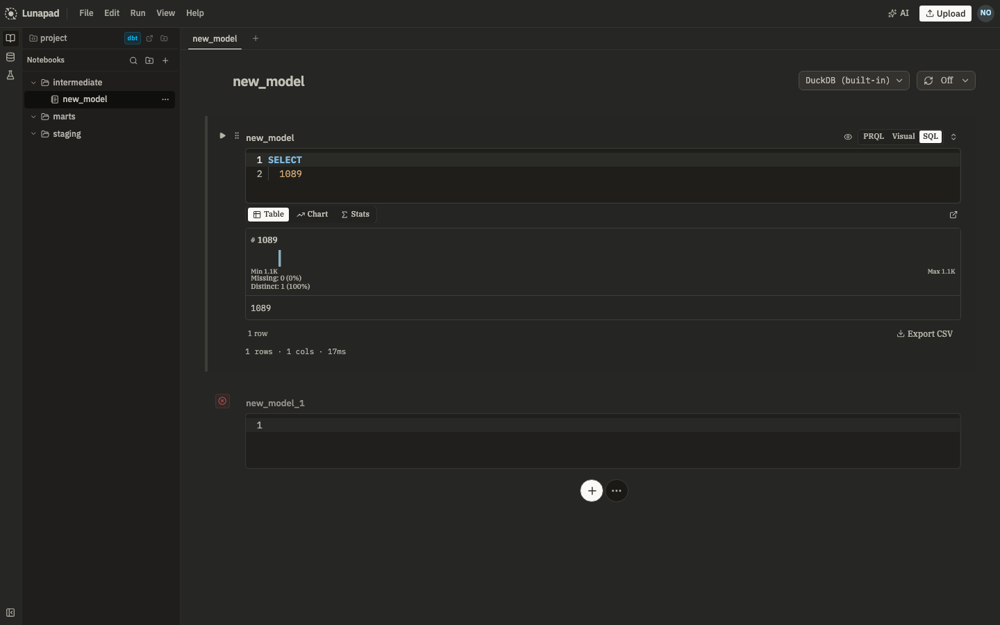

# Getting started

## Run it

```bash
docker compose up --build   # first run, builds the app image (a few minutes)
docker compose up -d        # subsequent starts
```

This starts four services:

| Service  | What it's for                                  | URL                   |
| -------- | ---------------------------------------------- | --------------------- |
| Lunapad  | the app                                        | http://localhost:3967 |
| Trino    | query engine for external data sources         | http://localhost:8067 |
| Postgres | shared workspace, accounts, connection secrets | localhost:5432        |
| Inngest  | scheduler for cron model runs                  | http://localhost:8267 |

Trino takes about a minute to finish starting. The app waits for Trino to report healthy before it serves requests, so the first `docker compose up` sits for a bit before anything loads in the browser. Run `docker compose ps` and wait until every service says `healthy`. Until then you may see a connection error or a blank page; that's normal on first boot.

## First login

Open `http://localhost:3967`. You'll land on a setup screen asking you to create an account. The first account you create becomes the admin, and signup closes immediately after, so nobody else can self-register. The admin adds teammates later from Settings → Team (covered in [self-hosting](11-self-hosting.md)).

After that, every visit goes through a normal login.



Once you're in, the notebook header has toggles for the **Review** panel (team comments) and the **AI** assistant (⌘J). You don't need either to run your first query, but they're there when you want them.

## Try a query without setting anything up

Lunapad ships with a sample dataset wired up out of the box. Open a notebook, add a cell, and run:

```sql
SELECT * FROM tpch.tiny.nation
SELECT * FROM tpch.tiny.orders LIMIT 100
```

`tpch` is a built-in Trino catalog; you don't configure it. A second catalog, `docker_postgres`, points at the bundled Postgres instance with the same `tpch.tiny.*` tables. Try joining across them if you want to see cross-source queries without standing up another database (see [Connecting data](04-connecting-data.md)).

You can also write to the built-in DuckDB engine with no catalog prefix at all. That's the default connection for any new cell.

## Other ways to run it

**Desktop app.** Lunapad also ships as a native desktop app (Tauri-based) if you'd rather not run Docker. Functionality is the same; external data sources still need Trino running somewhere reachable.

**Local development.** If you're modifying Lunapad itself rather than just using it, see the repository's main `README.md` for `pnpm dev` instructions.

## Next

[Notebooks and cells](02-notebooks-and-cells.md) covers how to actually work in the app once you're logged in.
