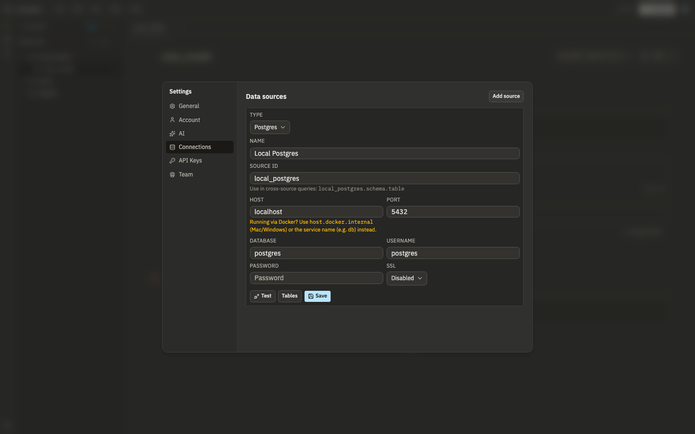
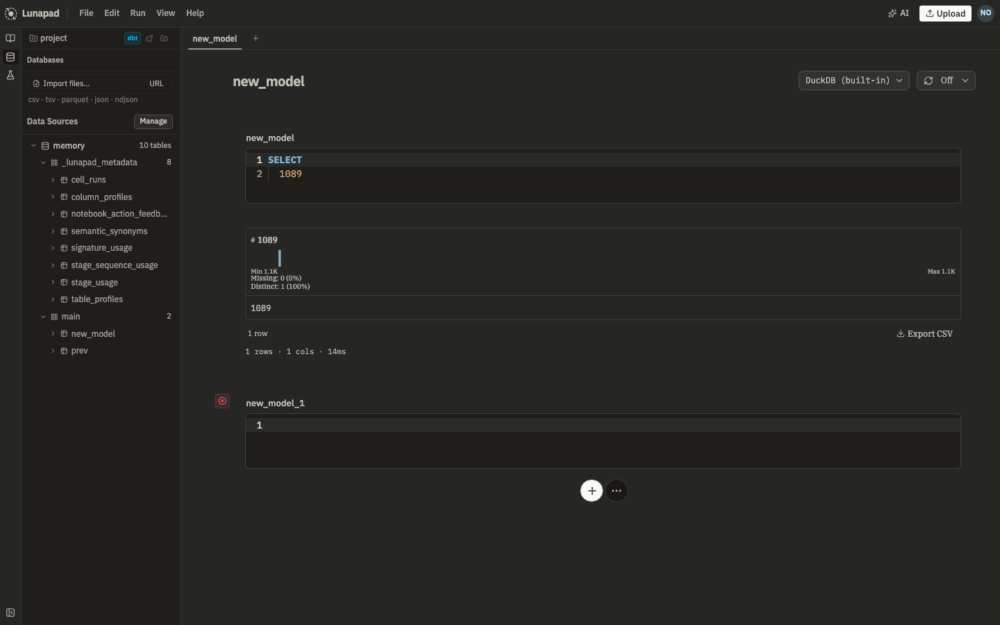

# Connecting data

## DuckDB (built in)

Every new cell defaults to a built-in DuckDB engine running entirely client-side, no setup, no external service. Good for quick analysis, uploaded files, or just trying Lunapad out.

## External sources: Postgres, ClickHouse, MySQL

Open **Data Sources** in the sidebar and click **Add source**. Fill in the connection details and save. Behind the scenes, Lunapad routes all external queries through Trino, so the three connection types behave consistently and can even be joined together in one query.

A few things specific to adding a source:

- **Source ID** is set once, at creation, and can't be changed afterward. It must start with a letter and contain only lowercase letters, digits, and underscores. If you need a different ID, remove the source and re-add it.
- After saving, expect a roughly 15-second wait while Lunapad registers the new source with Trino and waits for it to come back up.
- Connection passwords are stored encrypted, server-side. Your browser never holds or sends plaintext credentials, even when you're the one who typed them in.
- All external queries are checked to be read-only before they run. Lunapad can query your warehouse; it won't let a notebook cell write to it.



Once added, reference a source's tables with a three-part name:

```prql
from my_postgres.public.users
filter active == true
select {id, email}
```

## Cross-source joins

Because every external source is a Trino catalog under the hood, you can join across them in a single query, a Postgres table against a ClickHouse table, for instance, without moving data anywhere first:

```sql
SELECT u.email, o.total
FROM my_postgres.public.users u
JOIN my_clickhouse.analytics.orders o ON o.user_id = u.id
```

## Sample data

A `tpch` catalog ships built in (no setup, see [Getting started](01-getting-started.md)). If you're running the bundled Docker Compose stack, a `docker_postgres` catalog also points at the bundled Postgres instance, useful for testing cross-source joins without standing up a second database yourself.

## Uploading files

Drag a CSV (or similar) file into the upload dialog and it becomes a queryable table, no source configuration needed. Good for joining a one-off spreadsheet against your real data sources.

## Browsing schemas

The schema browser in the sidebar lists tables and columns across every connected source, DuckDB and external alike, so you can explore what's available before writing a query against it.



## Next

[Results, charts, and dashboards](05-results-charts-dashboards.md) covers what you do with a query once it runs.
