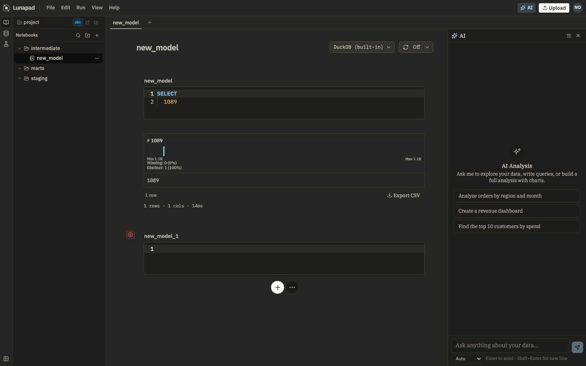
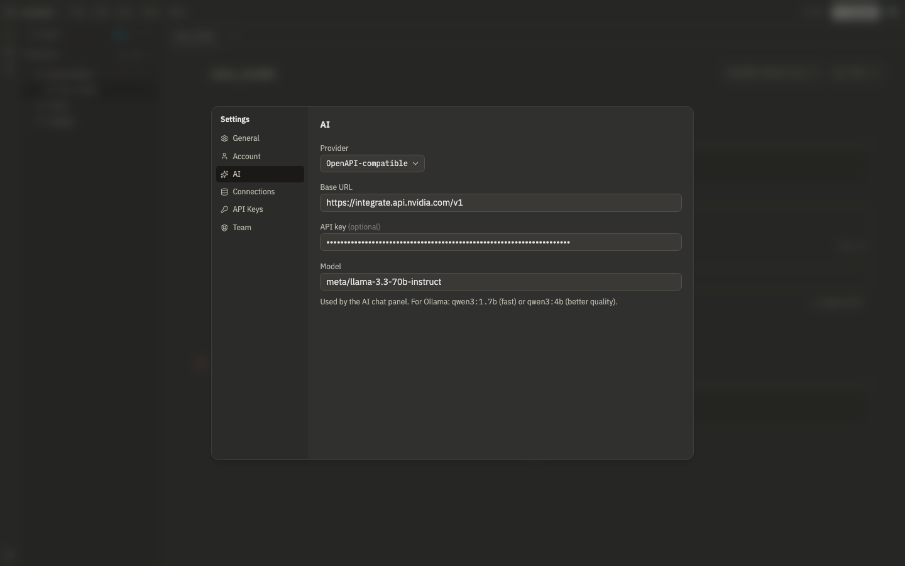

# AI assistant

The AI panel (⌘J) builds and edits models conversationally. There is no hosted model: you point Lunapad at Ollama or any OpenAI-compatible API in Settings → AI.

## What it does

Ask for a model in plain language. For non-trivial requests the assistant works in stages, shown as a stepper at the top of the thread:

1. **Discovery** checks whether an existing model already does roughly what you're asking for, so you don't end up with three near-duplicate `orders_*` tables.
2. **Modeling** proposes a name, materialization, dependencies, and grain before writing SQL.
3. **Generation** writes PRQL or SQL into notebook cells.
4. **Review** scores its own output and may suggest dbt-style assertions you can run later.

You approve or steer at each stage. The assistant won't silently overwrite cells without going through the tools.

## Inline cell AI

You don't have to open the panel for every edit. Focus a query cell and press **⌘⇧K** to open the inline prompt bar. Describe the change ("filter to last 30 days", "fix the join key"). The model proposes new code; you apply or discard.

When a cell fails, the error popover has **Fix with AI**, which opens the same bar with a pre-filled instruction so you don't retype the error context.

**Continue in chat** hands a hard problem to the full assistant thread with the cell already in context.

## Workspace standards

Open **Modeling standards** from the AI panel menu (⋯). Set naming patterns, preferred materializations, and style rules once. The assistant reads them on every conversation instead of you repeating conventions in each prompt.

## Sprint board

When the assistant breaks work into multiple tasks (several models, a dashboard, tests), tasks appear on a sprint board inside the panel. Each card has a status: queued, in progress, done, or blocked. Click a card to jump to the related cells or messages in the thread.

The board is a view on the current conversation, not a separate project manager. Clear the conversation and the board clears too.

## Memory

The assistant stores embeddings of past prompts and outcomes in Postgres (`ai_memory` on the server). When you ask something similar to a prior request, retrieval may surface cells, models, or decisions that worked before.

Memory is shared across the deployment (not per user). It does not replace reading the code the assistant just wrote. **Clear conversation** resets the visible thread and session tools; retrieval can still influence the next request.

Workspace **modeling standards** (naming, materializations, style) are separate from memory. They live in the workspace blob and apply to every conversation until you change them.

## Ghost text

With an LLM configured, optional ghost completions appear in Monaco as gray suffix text while you type PRQL/SQL. Tab to accept. Toggle in Settings → AI. Ghost text needs a provider; it does nothing without one.

## Per-user LLM config

API keys and model settings are stored in **your** account (`user_settings` in Postgres), not the shared workspace blob. Each teammate configures their own provider in Settings → AI. The workspace still holds shared modeling standards and notebook content.

| Field    | What to put                                         |
| -------- | --------------------------------------------------- |
| Provider | `Ollama` or `OpenAPI-compatible`                    |
| Base URL | Your Ollama or API endpoint                         |
| API key  | Optional; leave blank for local Ollama with no auth |
| Model    | The model name, e.g. `qwen3:4b` for Ollama          |

For Ollama, `qwen3:1.7b` is fast and `qwen3:4b` is better quality but slower. Without a provider configured, the AI panel and inline prompts have nothing to call.

Self-hosting with Docker Compose and Ollama on the host: point the base URL at `http://host.docker.internal:11434` (wired in the bundled `docker-compose.yml`, see [self-hosting](11-self-hosting.md)).

## What it can't do

- Run without you supplying an LLM endpoint.
- Query the built-in DuckDB engine through the automation API (no server-side DuckDB for headless runs).
- Edit cells you don't have permission to change (viewers can comment but not edit notebooks).
- Guarantee correct SQL. Review before you promote to dbt or publish a share.

## Next

[dbt projects](08-dbt-projects.md).
