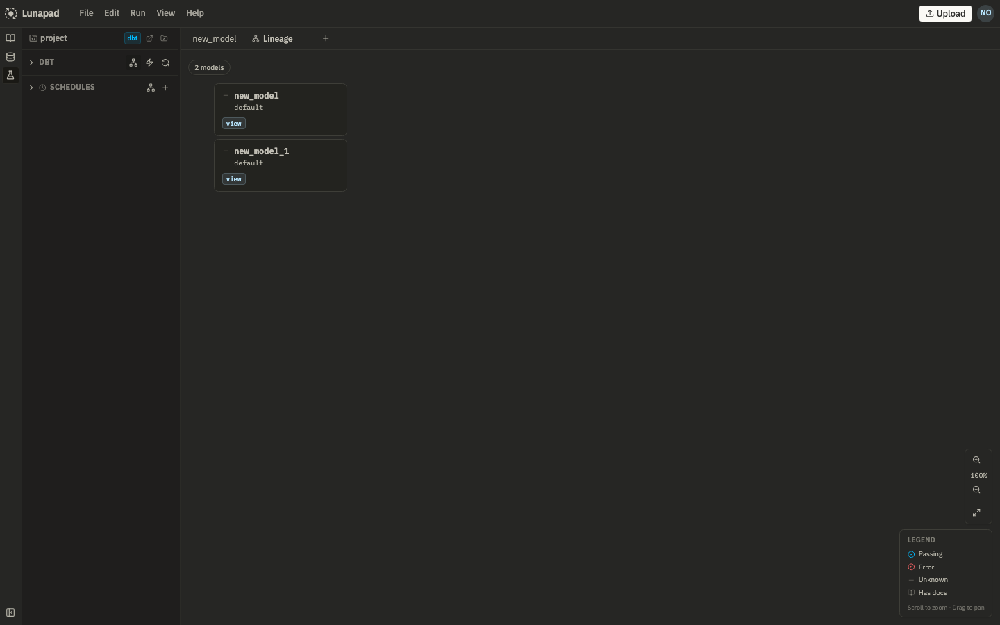

# dbt projects

Lunapad notebooks can live entirely in the browser, or they can be backed by a real dbt project on disk. Opening a project folder switches a notebook from "browser scratchpad" to "files dbt can build."

## Opening a project

Use **File → Open project** and point it at a folder with a `dbt_project.yml`, or let your deployment's default project folder open automatically (see `PROJECT_FOLDER` in [self-hosting](11-self-hosting.md)). If you open an empty folder, Lunapad scaffolds a starter dbt project into it (staging/marts layout, `profiles.yml`, the works) so you're not starting from nothing.

## Two shapes a notebook can take on disk

Once a project is open, a notebook is backed by real files, but not always the same kind of file:

- **One file per model.** A notebook made of cells that each already have their own `.prql` or `.sql` file under `models/`. Every one of these cells is, from the moment it's saved, a real dbt model: dbt can compile it, run it, test it, schedule it, show it in lineage. This is what you get from "New notebook" in the sidebar today.
- **A single `.luna` notebook file.** Markdown and query cells interleaved in one file, in the order they appear in the notebook, the same way the notebook looks in the editor. Cells in a `.luna` notebook are **not** dbt models yet, dbt's own build doesn't see them, even though the file lives in your project and is checked into version control like anything else. They're for exploring and iterating without committing every experiment to your model graph.

Either way, you're always working in the same notebook UI. The difference is just what happens on disk and what dbt can see.

## Promoting a cell to a real model

When a cell in a `.luna` notebook is ready to be an actual dbt model, right-click it and choose **Promote to dbt model**. This writes it out as its own `.prql` or `.sql` file under `models/`, in whatever schema/folder you target, and replaces the cell in the `.luna` notebook with a reference to the now-promoted model. From that point on, it behaves exactly like a model that was a standalone file all along: compile, run, test, schedule, lineage, all available.

Promotion is one-way and per-cell. You can promote a chain of cells at once (ancestors get written before dependents, so `ref()` calls resolve correctly), and leave the rest of the notebook as exploratory `.luna` cells.

## Compile, run, and test

For any cell backed by a real model file (promoted or not), Lunapad can:

- **Compile** it through the dbt CLI and show you the resulting SQL.
- **Run** it (`dbt run --select model`).
- **Test** it against whatever's defined in `schema.yml` for that model.

Logs stream live as these run. Cells still living inside an unpromoted `.luna` notebook run interactively in Lunapad the normal way (compiled and executed directly, the same as any notebook cell) but won't show up in a `dbt run` or have dbt tests until promoted.

Add tests in `schema.yml` (unique, not_null, relationships, accepted_values, etc.). Lunapad surfaces pass/fail on the cell and in lineage after you run tests.

## Lineage

The lineage view shows your model graph: dependencies between models, pass/fail status from the last test run, pulled straight from dbt's manifest. Only promoted/file-backed models appear here. Unpromoted `.luna` cells don't, because dbt's build never sees them.

## Scheduling

Open the schedule modal on a promoted model. Set a label, a cron expression, and an optional `dbt select` expression to scope which models actually run (defaults to just that model). Scheduling is powered by Inngest as a sidecar service. Watch job status in Inngest's UI (`http://localhost:8267` in Docker Compose) or from the model's run history in Lunapad.

## Next

[Sharing and reports](09-sharing-and-reports.md).
