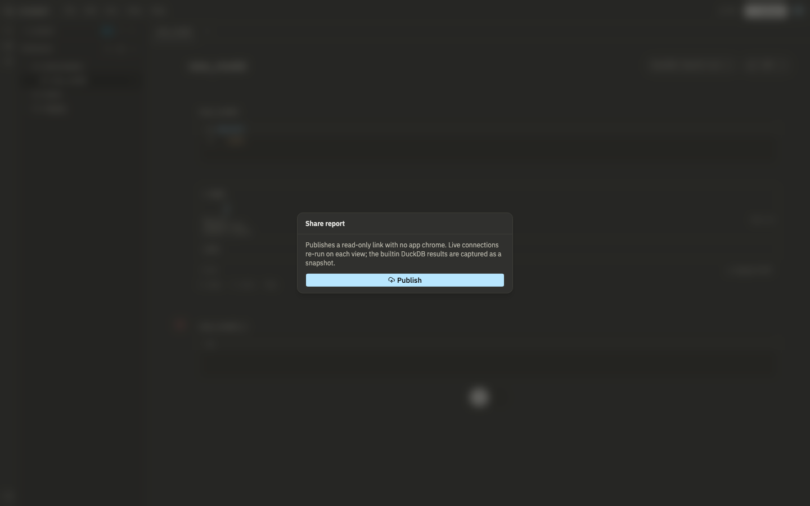

# Sharing and reports

## Publishing a share link

Open a notebook or report and click **Share**. Publishing gives you a public, read-only URL with no Lunapad chrome around it, just the rendered content. Anyone with the link can view it; they don't need a Lunapad account.

What "live" means depends on the connection:

- Cells on an external connection (Postgres, ClickHouse, MySQL) re-run their query every time someone loads the page.
- Cells on the built-in DuckDB engine are captured as a snapshot at publish time, since there's no server-side DuckDB to query on demand.

You can set how often the page polls for fresh results (in seconds) and re-publish on demand with **Update snapshot**.

**Regenerate link** issues a new token and invalidates the old one. **Revoke** takes the page down entirely. Both are useful if a link leaked further than you meant it to.

Live re-runs are rate-limited server-side, so a popular shared link can't be used to hammer your data source.

## Evidence.dev

If you want more polished, code-based reports than markdown widgets give you, Lunapad can detect and run an [Evidence](https://evidence.dev) project alongside it, querying the same data sources. This only applies if your project folder is set up as an Evidence project; otherwise there's nothing to detect and the option simply doesn't appear.

## Next

[API and MCP](10-automation-api.md).
