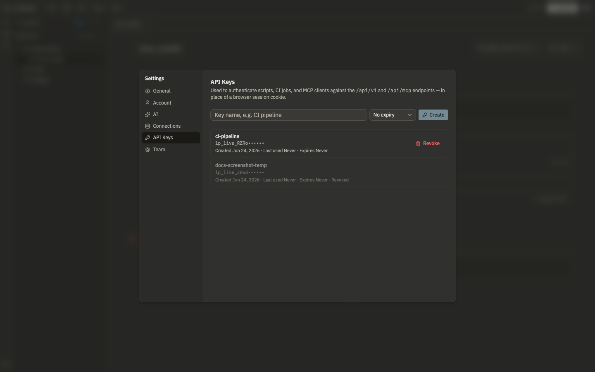

# API and MCP

Lunapad exposes a REST API and an MCP server, both protected by the same personal API keys. Use them to script against your workspace from CI, a cron job, or an MCP-capable client like Claude Desktop or Claude Code.

This is built for a trusted, self-hosted team, not as a public multi-tenant integration surface. Anyone with a valid key can act on the shared workspace exactly as if they were logged in.

## Creating a key

Open Settings → API Keys. Give it a name (so you can tell keys apart later), an optional expiry (30/90/365 days, or never), and create it. The full key is shown exactly once, copy it immediately, Lunapad only stores a hash afterward and can't show it to you again. Revoke a key any time from the same screen.



A key works as a bearer token in place of a browser session cookie:

```bash
curl http://localhost:3967/api/v1/connections \
  -H "Authorization: Bearer lp_live_..."
```

## REST API (`/api/v1`)

A deliberately curated subset, not full parity with every UI-supporting route:

| Endpoint                       | What it does                                 |
| ------------------------------ | -------------------------------------------- |
| `GET /api/v1/connections`      | List configured data sources                 |
| `POST /api/v1/query`           | Run raw SQL against a connection             |
| `POST /api/v1/prql`            | Compile PRQL and run it against a connection |
| `GET /api/v1/notebooks`        | List notebooks (project-folder mode only)    |
| `GET /api/v1/notebooks/[id]`   | Get one notebook's cells                     |
| `POST /api/v1/dbt/run`         | Run dbt models                               |
| `POST /api/v1/dbt/compile`     | Compile dbt models                           |
| `GET /api/v1/dbt/jobs/[jobId]` | Check a dbt job's status                     |
| `GET /api/v1/dbt/manifest`     | Get the compiled model graph                 |

Notebook listing only works when a project folder is open in filesystem mode (see [dbt projects](08-dbt-projects.md)); ad hoc browser-only notebooks aren't reachable this way. The built-in DuckDB engine is also out of scope here, there's no server-side DuckDB to run a query against headlessly, so `query`/`prql` calls need a real connection id.

## MCP server (`/api/mcp`)

The same API keys work as bearer auth for an MCP client. Point any MCP client that supports streamable HTTP at `http://your-host:3967/api/mcp` with an `Authorization: Bearer <key>` header, and these tools become available:

| Tool                 | What it does                              |
| -------------------- | ----------------------------------------- |
| `list_connections`   | List configured data sources              |
| `run_query`          | Run SQL against a connection              |
| `run_prql`           | Compile and run PRQL against a connection |
| `list_notebooks`     | List notebooks (project-folder mode)      |
| `get_notebook`       | Get one notebook's cells                  |
| `dbt_run`            | Run dbt models                            |
| `dbt_compile`        | Compile dbt models                        |
| `get_dbt_job_status` | Check a dbt job's status                  |
| `get_dbt_manifest`   | Get the model graph                       |

This is meant for local or team use, talking to your own Lunapad instance from your own tools, not for exposing your data to unknown third parties. There's no per-tool permission scoping beyond the key itself: a key can do anything its owner could do from the UI.

## Next

[Self-hosting](11-self-hosting.md).
