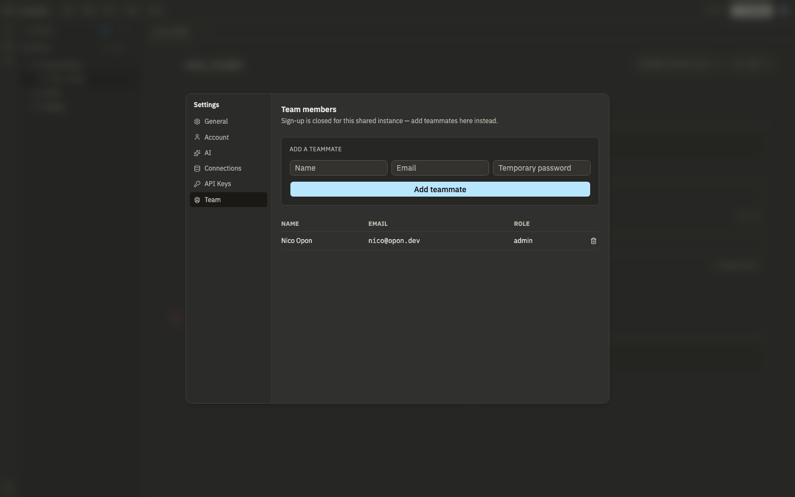

# Self-hosting

## Docker Compose (recommended)

The bundled `docker-compose.yml` runs four services:

- **app**: Lunapad itself
- **db**: Postgres, the source of truth for accounts, the shared workspace, comments, sites, and connection metadata/secrets in full (non-demo) mode
- **trino**: fronts every external data source (Postgres/ClickHouse/MySQL/Snowflake connections become Trino catalogs)
- **inngest**: runs scheduled dbt model builds

Start order matters and is health-checked automatically: Postgres, then Trino, then the app, then Inngest. First start takes about a minute because Trino needs that long to come up.

```bash
docker compose up --build   # first run
docker compose up -d        # subsequent starts
docker compose logs -f      # tail everything
docker compose ps           # confirm everything is "healthy"
docker compose down         # stop, keep data
docker compose down -v      # stop and wipe everything (fresh start)
```

## Environment variables

Set these on the `app` service. The committed `docker-compose.yml` ships working defaults for local trial use; replace the secrets before deploying anywhere real.

| Variable                                                         | Default in the compose file                    | What it's for                                                                                                                                                                 |
| ---------------------------------------------------------------- | ---------------------------------------------- | ----------------------------------------------------------------------------------------------------------------------------------------------------------------------------- |
| `DATABASE_URL`                                                   | `postgresql://lunapad:lunapad@db:5432/lunapad` | Connection string for the shared Postgres instance                                                                                                                            |
| `BETTER_AUTH_SECRET`                                             | `change-me-to-a-random-32-byte-secret`         | Signs session tokens. **Replace this before any real deployment.**                                                                                                            |
| `SECRETS_ENCRYPTION_KEY`                                         | `change-me-to-a-random-32-byte-base64-key`     | Encrypts stored connection passwords at rest. **Replace this too, and never reuse the value from `BETTER_AUTH_SECRET`.**                                                      |
| `TRINO_URL`                                                      | `http://trino:8080`                            | Where the app reaches Trino                                                                                                                                                   |
| `TRINO_CATALOG_DIR`                                              | `/trino-catalog`                               | Where catalog `.properties` files are written when you add a data source                                                                                                      |
| `PROJECT_FOLDER`                                                 | `/app/project`                                 | A dbt project folder to auto-open on startup. If it's empty, a starter project is scaffolded into it. Opening a different folder from the UI overrides this on later reloads. |
| `PROJECTS_ROOT`                                                   | `/app/projects`                                | Parent folder for tenant-owned Lunapad projects created from setup or the project switcher. Each project gets its own dbt-ready subfolder.                                    |
| `OLLAMA_BASE_URL`                                                | `http://host.docker.internal:11434`            | Reaches an Ollama install running on the host machine, only relevant if you're using Ollama for the AI assistant                                                              |
| `INNGEST_BASE_URL` / `INNGEST_EVENT_KEY` / `INNGEST_SIGNING_KEY` | `http://inngest:8288` / `local` / `local`      | Scheduler connection. Omit `INNGEST_BASE_URL` entirely to disable scheduling                                                                                                  |
| `DEMO_MODE`                                                      | unset                                          | Set to `1` for a public, read-only demo deployment (see below)                                                                                                                |
| `DEPLOYMENT_MODE`                                                | `self_hosted`                                  | `self_hosted` keeps the one-team default org/project behavior. `cloud` is for hosted multi-tenant operators and requires additional infrastructure.                           |

## What's stored where

| Location                             | Holds                                                                                         |
| ------------------------------------ | --------------------------------------------------------------------------------------------- |
| Postgres `workspace_state`           | Shared notebooks, cells, tabs, workspace standards (one JSONB row)                            |
| Postgres `user_settings`             | Per-user AI provider config (API keys, model name)                                            |
| Postgres `comment_*` tables          | Review threads, messages, reactions                                                           |
| Postgres `sites` / `site_pages`      | Multi-page report sites and nav                                                               |
| Postgres `shared_reports`            | Published share tokens and metadata                                                           |
| Postgres auth tables                 | Accounts, sessions, roles                                                                     |
| Your browser's local storage         | A cache of the workspace for fast load; not the source of truth in full mode                  |
| Your project folder (if one is open) | Your actual dbt project: model files, `.luna` notebook files, `schema.yml`, `dbt_project.yml` |
| `./trino/catalog/`                   | One `.properties` file per external data source you've registered                             |

Setup creates the first organization/workspace, admin membership, and starter
project explicitly. Existing self-hosted installs can still use the legacy
default organization/project and `/app/project` folder, but new projects created
from the switcher live under `PROJECTS_ROOT` and are scaffolded as dbt projects
by default.

Back up the Postgres volume and your project folder. Everything else is reconstructible or derived.

## Workspace sync

The browser debounces saves and POSTs the workspace blob to `/api/workspace/save` with an `expectedUpdatedAt` timestamp. If someone else saved in between, the server returns **409 Conflict** and the UI offers **Reload** or **Keep mine**. See [Comments and review](13-comments-and-review.md).

## Roles

| Role   | Notebooks  | Connections | dbt run | Publish shares | Admin |
| ------ | ---------- | ----------- | ------- | -------------- | ----- |
| admin  | read/write | manage      | yes     | yes            | yes   |
| editor | read/write | query       | yes     | yes            | no    |
| viewer | read only  | query       | read    | no             | no    |

All roles can write comments. Legacy `user` in the database is treated as editor.

## Adding teammates

Only admins can add accounts; there's no open signup after the first account.

**Settings → Team (UI today):** name, email, temporary password. The new user can log in immediately. Role defaults to whatever better-auth assigns (typically editor); there's no role dropdown in the form yet.

**Invitations API (alternative):** admins can `POST /api/invitations` with `{ "email": "...", "role": "editor" | "viewer" }`. The response includes a token; send the invitee `/invite/{token}`. They set a password and get the invited role. List pending invites with `GET /api/invitations`. Revoke with `DELETE /api/invitations?id=...`. No email is sent automatically; you deliver the link yourself.



## Upgrading

```bash
docker compose pull
docker compose up -d
```

Data persists across this as long as you don't run `down -v`, since that wipes the Postgres volume along with everything in it.

## Demo mode

Setting `DEMO_MODE=1` turns off authentication and blocks routes that would let a visitor reach external connections, dbt, the workspace-persistence API, or the automation API. Run it for a public read-only demo on sample data, not for a deployment with real credentials.

Visitors land directly in the **Sales Analytics Demo** notebook with all cells pre-run. Data stays in DuckDB WASM in the browser — nothing is persisted server-side.

### One-command public demo

```bash
docker compose -f docker-compose.yml -f docker-compose.demo.yml up -d
```

Copy [`.env.demo.example`](../../.env.demo.example) to `.env` and set `ORIGIN` to the URL users reach the app at (e.g. `https://demo.example.com`).

| Setting          | Demo value | Effect                                                           |
| ---------------- | ---------- | ---------------------------------------------------------------- |
| `DEMO_MODE`      | `1`        | No login; blocks connections, dbt, workspace API, automation API |
| `PROJECT_FOLDER` | empty      | Skips auto-opening a dbt project folder                          |

For marketing or screenshot links, append `?demo=1` to force a fresh demo notebook run even if the visitor has local state cached (`https://your-demo.example.com/?demo=1`).

In a normal (non-demo) install, first-time visitors see a welcome dialog; they can also load the demo anytime from **File → Explore demo notebook**.

## Other ways to run it

- **Desktop app.** A native Tauri build, if you'd rather not run Docker at all.
- **Hosted cloud stack.** Use `docker-compose.cloud.yml` with the base compose file to
  run cloud mode with open signup, a worker, RustFS storage, and Mailpit SMTP:
  `docker compose -f docker-compose.yml -f docker-compose.cloud.yml up --build`.
- **Outside Docker.** Possible, but you're then responsible for running Postgres, Trino, and (optionally) Inngest yourself and pointing the same environment variables at them. See the repository's main `README.md` for the local development setup.

## Next

[FAQ and troubleshooting](12-faq-troubleshooting.md).
