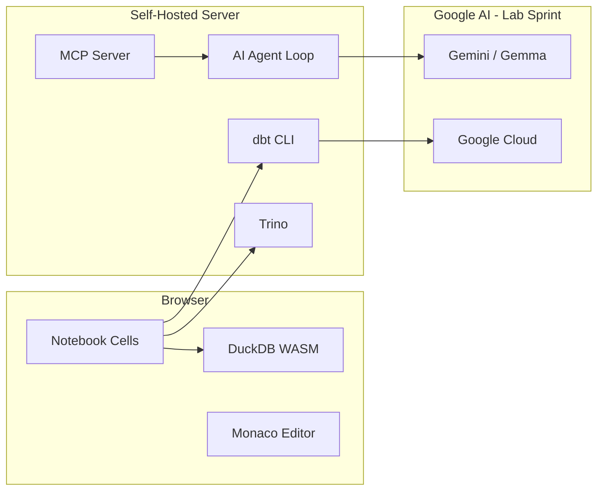

# Lunapad — Pitch Deck (Google Africa Applied AI Lab)

**Application target:** [Google Africa Applied AI Lab](https://labs.google/aifuturesfund/africaailab) / Google AI Futures Fund  
**Stage:** Pre-launch (working product, no commercial traction yet)  
**Format:** 12 slides + appendix. On-deck bullets, speaker notes, and demo cues per slide.

**Positioning rule:** Lunapad is a global product. Africa appears in this deck only where the Lab application requires it — program fit, co-development plan, Demo Day — not as the product identity.

---

## Slide 1 — Title

**On deck**

- **Lunapad** — AI-native SQL notebook where each cell is a model
- Explore in the browser · chain dependencies by name · promote to dbt when ready
- Founder: [Your name] · [Contact]

**Speaker notes**

Open with: *"Lunapad is the missing layer between SQL exploration and production dbt — a notebook where cells are models, not throwaway queries."* Identity is **SQL notebook / data model IDE**. Not BI. Not a chatbot. Not regional charityware.

**Demo cue**

End on the product UI — notebook with inline results, cell names visible in the gutter.

---

## Slide 2 — The Problem

**On deck**

- Data teams live in **two worlds** that don't connect:
  - **Exploration:** notebooks, ad hoc SQL, one-off answers
  - **Production:** dbt models, tests, lineage, scheduled runs
- The gap costs real money:
  - BI tools consume models but don't **build** them
  - SQL editors run queries but don't **chain** dependencies or promote to disk
  - dbt projects need engineers most early-stage teams don't have yet
- Result: copy-paste SQL between tools, divergent dashboards, models that never ship

**Speaker notes**

Persona: a 20-person startup with one person who does "the data" — or a 5-person analytics team at an agency shipping client models weekly. They don't need another dashboard. They need **models that compile, chain, and promote**.

**Adversarial prep**

"Isn't this Metabase + a spreadsheet?" — Metabase reads models. Lunapad **writes** them, with lineage and a path to dbt.

---

## Slide 3 — Why Now

**On deck**

- **Agentic AI** can scaffold SQL — but only with governed context (schema, lineage, naming rules)
- **dbt** is the production standard — yet exploration still happens elsewhere (Hex, DataGrip, raw SQL)
- **Incumbents are splitting the problem:** dbt Wizard for enterprises on dbt Cloud; Hex for funded analyst teams; BI copilots for consumers
- **Gap:** a self-hostable workbench for teams that need exploration **and** productionization in one surface, with AI that reads the model graph

**Speaker notes**

Why Google Lab specifically: Gemini needs a structured data context to be useful — Lunapad provides cells, lineage, dbt manifest, and workspace standards. That's a co-development story, not a geography story.

Program themes: **work** (fewer people ship more models), **knowledge** (reproducible data products), **software development** (notebook → dbt → CI/MCP).

---

## Slide 4 — The Product

**On deck**

- **Lunapad** = SQL notebook + model graph + inline results + dbt integration
- Each cell has an **output name**; referencing it auto-builds a CTE dependency chain at runtime
- Runs in the browser:
  - **DuckDB WASM** — zero-config, no warehouse required
  - **Trino** — Postgres, ClickHouse, MySQL, and more
- Tagline from product doctrine: *"SQL notebook / data model IDE"*

**Speaker notes**

Analysts want fast iteration with inline results. Engineers want a model-graph IDE that respects their dbt project. Same tool, same cells. The notebook preview **is** the proof.

**Demo cue**

Two cells: `orders_clean` → `monthly_summary`. Run the second; show compiled SQL with `WITH orders_clean AS (...)`.

---

## Slide 5 — User Workflow

**On deck**

1. **Connect** — Postgres/ClickHouse/MySQL via Trino, or start on DuckDB sample data instantly
2. **Explore** — PRQL, SQL, or visual pipeline; results inline
3. **Chain** — name cells; dependency graph resolves automatically
4. **Promote** — notebook cells become real dbt model files on disk
5. **Publish** — dashboards, Markdoc reports, share links
6. **Automate** — REST API + MCP for CI/agents; Inngest for scheduled `dbt run`

**Speaker notes**

The **promotion moment** is the wedge. Hex stops at the notebook. dbt Cloud assumes you're already in dbt. Lunapad owns the handoff: explore cheaply, productionize deliberately.

**Demo cue**

60 seconds: `SELECT * FROM tpch.tiny.orders` → filter cell → aggregate cell → promote to dbt → manifest lineage view.

---

## Slide 6 — Google AI Integration (Material Use)

**On deck**

Lunapad ships a four-stage AI assistant: **Discovery → Modeling → Generation → Review**. Lab deliverable: make **Gemini/Gemma** the default, eval-backed copilot.

| Capability | Gemini/Gemma role |
|------------|-------------------|
| **Discovery** | Check existing models before creating duplicates |
| **Modeling** | Propose name, grain, materialization, dependencies before writing SQL |
| **Generation** | PRQL/SQL into cells; inline ⌘⇧K edits; "Fix with AI" on compile errors |
| **Review** | Self-score output; suggest dbt tests |
| **Standards** | Workspace modeling rules injected into every prompt |
| **Memory** | Retrieval over prior successful models (embeddings in Postgres) |
| **Orchestration** | Sprint board for multi-model tasks — agent workflow, not one-shot chat |
| **Interop** | MCP server + Data Agent Kit reference workflow |

**Not a wrapper:** AI reasons over **cells, lineage, and dbt graph** — not raw text-to-SQL.

**Speaker notes**

Today: BYOK (Ollama, OpenAI-compatible). Lab sprint: first-class Gemini provider, context packaging, 20-task eval harness, optional Gemma for self-hosted inference. Material Google AI use without exclusivity.

**Demo cue**

"Analyze orders by region and month" → discovery stepper → generated cells → review score. If Gemini isn't wired yet, demo on Ollama and show the integration architecture.

---

## Slide 7 — Who It's For

**On deck**

**Primary buyers**

- Startups with 0–2 data people who still need governed models
- Analytics agencies shipping client dbt projects
- Teams adopting dbt who lack a good exploration surface
- Self-hosters: fintech, health, gov-adjacent — anywhere data can't leave your infra

**Why they pick Lunapad over alternatives**

| Need | Lunapad | Typical alternative |
|------|---------|---------------------|
| Explore without a warehouse | DuckDB in browser | Spin up Snowflake trial |
| Chain models without manual CTEs | Named cells | Copy-paste in DataGrip |
| Get to production dbt | One-click promote | Rebuild in dbt by hand |
| Run on your own metal | Docker Compose | SaaS-only (Hex, dbt Cloud) |
| AI that knows your graph | Lineage-aware agent | Generic ChatGPT |

**Speaker notes**

Don't pitch "underserved markets." Pitch **structural fit**: teams too small for the full modern stack, too serious for spreadsheets. That's global — seed startups in SF, agencies in London, ops teams everywhere. The Lab gives us distribution and design partners; it doesn't define the product.

---

## Slide 8 — Competitive Landscape

**On deck**

| | Lunapad | Hex | dbt Wizard | BI Copilots | Text-to-SQL |
|---|---------|-----|------------|-------------|-------------|
| Notebook exploration | ✓ | ✓ | partial | ✗ | ✗ |
| Model dependency graph | ✓ | partial | ✓ | ✗ | ✗ |
| Browser-native DuckDB | ✓ | ✗ | ✗ | ✗ | ✗ |
| dbt on-disk promotion | ✓ | ✗ | ✓ | ✗ | ✗ |
| Self-host / air-gap | ✓ | partial | partial | ✗ | ✗ |
| AI with lineage context | ✓ (Lab) | partial | ✓ | shallow | shallow |

**Positioning:** *The model-building workspace between exploration and production.*

**Speaker notes**

Hex = analyst teams with budget. dbt Wizard = enterprises on dbt Cloud. Lunapad = teams that need **both** surfaces in one deployable package, self-hosted, with a promotion path built in.

---

## Slide 9 — Go-to-Market (Pre-Launch)

**On deck**

**Phase 0 — Now**

- OSS core + Docker self-host (demo mode for frictionless trials)
- 5–8 design partners: startups, agencies, one in-house data team
- Success metric: ≥3 chained models + 1 promoted dbt model + 1 published report per partner

**Phase 1 — Post-Lab**

- Managed cloud on Google Cloud (optional)
- Team seats + AI quota (Gemini bundled or pass-through)
- Channels: dev agencies, accelerator portfolios, dbt community, GCP marketplace path

**Pricing hypothesis**

- Self-host: free / OSS
- Team cloud: $49–199/seat/mo
- AI: included quota + overage

**Speaker notes**

No revenue yet. Lab period = Gemini integration + design-partner proof, not sales scale. Partners can be anywhere; Lab VC network is one channel, not the only one.

---

## Slide 10 — Demo Story (Demo Day Script)

**On deck**

**Scenario:** *"Weekly revenue cohort report — from raw orders to production dbt model"*

1. Connect to Postgres (or bundled demo data)
2. AI discovery: "You already have `orders_staging` — extend it, don't duplicate"
3. Agent generates `orders_enriched` + `cohort_weekly` cells
4. Inline results + chart in Markdoc report
5. Promote `cohort_weekly` to dbt; run `dbt test`
6. Share read-only link

**Time:** 8 min live · 3 min Q&A

**Speaker notes**

Rehearse the failure path: AI hallucinates a column → compile error → **Fix with AI** → passes `dbt test`. Recovery is memorable.

---

## Slide 11 — 90-Day Milestones (Lab Co-Development)

**On deck**

Mid-September → early December 2026:

| Week | Milestone | Google AI |
|------|-----------|-----------|
| **W1–2** | Gemini provider in Settings → AI; context packaging (schema + lineage + standards) | Model access; prompt review with mentors |
| **W3–4** | Eval harness: 20 golden tasks; baseline vs. Gemini | Iterate with Research feedback |
| **W5–6** | 3 design partners live (mixed verticals) | Gemma option for self-hosted inference |
| **W7–8** | MCP + Data Agent Kit reference workflow published | Align with Data Cloud agent patterns |
| **W9–10** | Each partner ships ≥1 production dbt model from notebook | Case study drafts |
| **W11–12** | Demo Day polish; metrics summary | Pitch at AICC Accra |

**Investability bar by Demo Day**

- ≥3 active design partners (weekly usage)
- Gemini live with measurable eval lift
- ≥1 promoted model in production dbt
- Self-host deploy &lt;30 min cold start

---

## Slide 12 — The Ask

**On deck**

**From the Lab / AI Futures Fund**

1. Early **Gemini/Gemma** access + mentorship on agent eval and context engineering
2. **Google Cloud credits** for hosted pilots and embedding/RAG
3. **Design-partner intros** via VC partners (Novastar, Ventures Platform, 4DX, Norrsken22)
4. **Demo Day** slot at Accra AI Community Centre (early December 2026)
5. **Potential investment** to fund Gemini sprint + first GTM hire

**Our commitments**

- Material Google AI in the shipped product
- In-person Demo Day
- Monthly progress updates during co-development

**Speaker notes**

Close on the product, not the program. *"Open the notebook — the tool is the hero."*

---

## Slide 13 — Why This Lab (application-only; optional appendix slide)

**On deck**

*Use only if reviewers ask "why Africa Applied AI Lab for a global dev tool?"*

- We're applying for **co-development**, not market labeling
- Gemini integration + eval is the Lab deliverable; we need DeepMind access and Research feedback
- VC partner network accelerates design-partner recruitment
- Demo Day forces a shipped, measurable outcome in 90 days
- Product is globally relevant; Lab is the catalyst to ship Gemini-native AI correctly

**Speaker notes**

Do not put this on slide 2. It's a footnote for the application form and Q&A, not the pitch spine.

---

## Appendix A — Team

*[Fill before submission]*

- Founder: data engineering / analytics / full-stack product
- Built: SvelteKit UI, Trino/dbt backend, AI agent loop, MCP, Docker deploy
- Hiring with Lab support: developer relations, first GTM hire

---

## Appendix B — Architecture

---

## Appendix C — Product Facts

From [README.md](../../README.md), [PRODUCT.md](../../PRODUCT.md), [07-ai-assistant.md](../guide/07-ai-assistant.md):

- Cells chain by `outputName`; CTE assembly at query time
- PRQL, SQL, visual pipeline
- AI: Discovery → Modeling → Generation → Review
- BYOK today; Gemini is the Lab deliverable
- REST API + MCP; Inngest for scheduled dbt
- Docker Compose self-host; demo mode available
